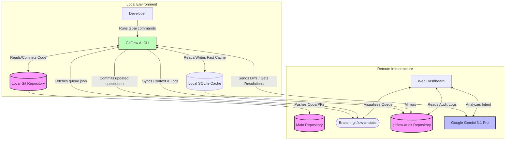

# GitFlow AI - Architecture

This document outlines the GitOps-native architecture of GitFlow AI, specifically detailing how the CLI, AI Engine, and Git repositories interact without requiring a centralized, traditional database.

## High-Level Architecture Diagram

## Component Details

### 1. GitFlow AI CLI (`git-ai`)
The core engine running on the developer's machine. It intercepts standard Git commands (like `commit`, `push`, `rebase`) and injects AI analysis. It also provides custom commands (`queue`, `benchmark`) to manage the SDLC.

### 2. The State Branch (`gitflow-ai-state`)
Instead of a centralized PostgreSQL or MongoDB database, GitFlow AI uses **GitOps** to manage the merge queue.
- A hidden, orphaned branch named `gitflow-ai-state` lives in the main repository.
- It contains a single `queue.json` file.
- When a developer runs `git-ai queue add`, the CLI uses Git plumbing commands (`git mktree`, `git commit-tree`) to update this file and push the new state.
- **Benefit:** Free audit log, zero infrastructure overhead, and respects existing repository RBAC (Role-Based Access Control).

### 3. The Audit Repository (`gitflow-audit`)
To prevent the main repository from being bloated by high-frequency AI logs, all operational data is stored in a separate `gitflow-audit` repository.
- **Context Storage:** Stores the conversational history between the developer and the AI (`context.json`).
- **Audit Trail:** Logs every AI decision, conflict resolution, and queue modification.
- **Local Cache:** The CLI maintains a local SQLite database (`~/.git-ai-context.db`) as a high-speed cache, which asynchronously syncs to the remote `gitflow-audit` repo.

### 4. Google Gemini 3.1 Pro
The intelligence layer. It performs:
- **Semantic Intent Analysis:** Understanding *why* code was written to determine merge risk.
- **Conflict Resolution:** Intelligently combining divergent code paths when Git's standard text-based merge fails.

### 5. Web Dashboard
A React-based frontend that provides a visual representation of the GitOps state. It reads the `queue.json` from the `gitflow-ai-state` branch and the logs from the `gitflow-audit` repo to display real-time metrics to engineering managers.
