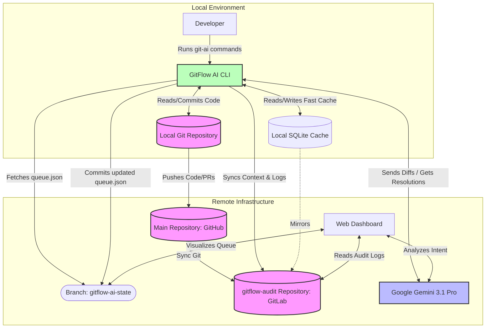

# GitFlow AI - Architecture

This document outlines the GitOps-native architecture of GitFlow AI, specifically detailing how the CLI, AI Engine, and Git repositories interact without requiring a centralized, traditional database.

## High-Level Architecture Diagram

## Component Details

### 1. GitFlow AI CLI (`git-ai`)
The core engine running on the developer's machine. It intercepts standard Git commands (like `commit`, `push`, `rebase`) and injects AI analysis. It also provides custom commands (`queue`, `benchmark`) to manage the SDLC.

### 2. The State Branch (`gitflow-ai-state`)
Instead of a centralized PostgreSQL or MongoDB database, GitFlow AI uses **GitOps** to manage the merge queue.
- A hidden, orphaned branch named `gitflow-ai-state` lives in the main repository.
- It contains a single `queue.json` file.
- When a developer runs `git-ai queue add`, the CLI uses Git plumbing commands (`git mktree`, `git commit-tree`) to update this file and push the new state.
- **Benefit:** Free audit log, zero infrastructure overhead, and respects existing repository RBAC (Role-Based Access Control).

### 3. The Audit Repository (`gitflow-audit`)
To prevent the main repository from being bloated by high-frequency AI logs, all operational data is stored in a separate `gitflow-audit` repository.
- **Context & Parameters:** Stores the conversational history, AI model parameters, prompts, and raw responses (`context.json`).
- **Conflict Artifacts:** When a conflict occurs between File A and File B, both original files and the final AI-generated merged file are checked into the audit repo for traceability.
- **Audit Trail:** Logs every AI decision, conflict resolution, and queue modification.
- **Local Cache:** The CLI maintains a local SQLite database (`~/.git-ai-context.db`) as a high-speed cache, which asynchronously syncs to the remote `gitflow-audit` repo.

### 4. Dual-Model AI Engine (Google Gemini 3.1 Pro)
The intelligence layer utilizes two distinct model phases to ensure safety and accuracy:
- **Phase 1: Resolution Model:** Performs Semantic Intent Analysis to understand *why* code was written and intelligently combines divergent code paths during a cherry-pick or merge.
- **AI Token Optimization:** During the sync workflow, the system is designed to save tokens by bypassing the AI model for clean cherry-picks. Gemini is only invoked when a Git conflict is detected, ensuring efficient use of AI resources.
- **Decoupled Code Review:** Code review is a separate, manual process triggered by the `git-ai review <range>` command. This allows developers to audit specific commit ranges independently of the automated sync/merge process.
- **Phase 2: Audit & Verification Model:** An independent model evaluation that reviews the final AI-generated merged file against the original conflicting files (File A and File B). It verifies that the conflict was correctly resolved without introducing syntax or logical errors.
- **Confidence Scoring (95/5 Rule):** The Audit Model assigns a Confidence Score. If the score is low (representing the 5% of conflicts the AI cannot confidently resolve), the CLI automatically pauses the merge queue or reverts the cherry-pick, alerting a human developer to intervene.

### 5. Web Dashboard
A React-based frontend that provides a visual representation of the GitOps state. It reads the `queue.json` from the `gitflow-ai-state` branch and the logs from the `gitflow-audit` repo to display real-time metrics to engineering managers.

## Advanced Core Features

### 1. GitLab API Integration Architecture
The platform implements a secure proxy layer for GitLab API v4 within the backend service. This enables the frontend to fetch project metadata, commit history, and merge request status without exposing the `GITLAB_TOKEN` to the client. The proxy handles rate limiting and data transformation, ensuring the UI receives optimized payloads for the repository graph and dashboard statistics.

### 2. Live Topology Visualization
The Repository Graph uses a dynamic coordinate mapping algorithm that translates GitLab commit parent-child relationships into a visual SVG/Canvas topology. It automatically identifies merge commits, branch forks, and orphaned branches in real-time, providing an accurate, live view of the Git tree.

### 3. The "Binary Search" Failure Isolation
When a batch of PRs fails Continuous Integration (CI), the orchestrator doesn't just fail the whole batch. It automatically splits the batch into two halves and merges them into separate staging branches. By recursively testing these halves, the AI isolates the specific breaking PR in **O(log N)** time, drastically reducing debugging time for large teams.

### 4. Atomic Union Groups
Gemini analyzes the dependency graph of all pending PRs. If PR-A modifies a function signature that is subsequently used by PR-B, they are grouped into a **Union Group**. These groups are merged atomically—if one PR in the group fails integration tests, the entire group is rolled back to maintain system stability and prevent broken main branches.

### 5. Semantic Intent Analysis
The orchestrator uses Gemini to build a "Semantic AST" (Abstract Syntax Tree) of the changes. Instead of comparing raw text lines like standard Git, it compares logic blocks. If PR-A renames a variable and PR-B uses the old variable name in a new function, GitFlow AI detects this as a logical conflict and automatically updates PR-B's code to use the new variable name, preventing a build failure that standard Git would miss.

### 6. Cross-Platform Semantic Translation
When syncing or merging between different Git providers (e.g., GitHub and GitLab), the AI doesn't just copy files. It translates platform-specific metadata on-the-fly. For example, it can convert GitHub Action YAML logic into GitLab CI/CD syntax to ensure that the target repository's automation remains functional across platforms.

## Future Work

While the core orchestration engine is complete, we envision the following enhancements for enterprise-scale deployments:

1. **Predictive CI/CD Scaling**: Using historical pipeline data to predict which PRs will take the longest to build, and automatically prioritizing them in the merge queue to optimize overall throughput.
2. **Deep Security Context**: Integrating Gemini with SAST/DAST tools to not only resolve semantic conflicts but to actively rewrite vulnerable code patterns during the merge process.
3. **IDE Integration**: Bringing the GitFlow AI orchestration layer directly into VS Code and IntelliJ via dedicated extensions, allowing developers to interact with the AI queue without leaving their editor.
4. **Jenkins & GitLab CI Integration**: Deeply integrating with Jenkins and GitLab CI pipelines to trigger, monitor, and manage complex build jobs directly from the AI orchestrator, creating a unified CI/CD control plane.

---

## Thank You!

Thank you to the judges for reviewing **GitFlow AI v2**. We built this platform to solve the very real pain of "Merge Hell" that engineering teams face every day. We hope you enjoyed exploring the architecture as much as we enjoyed building it!
