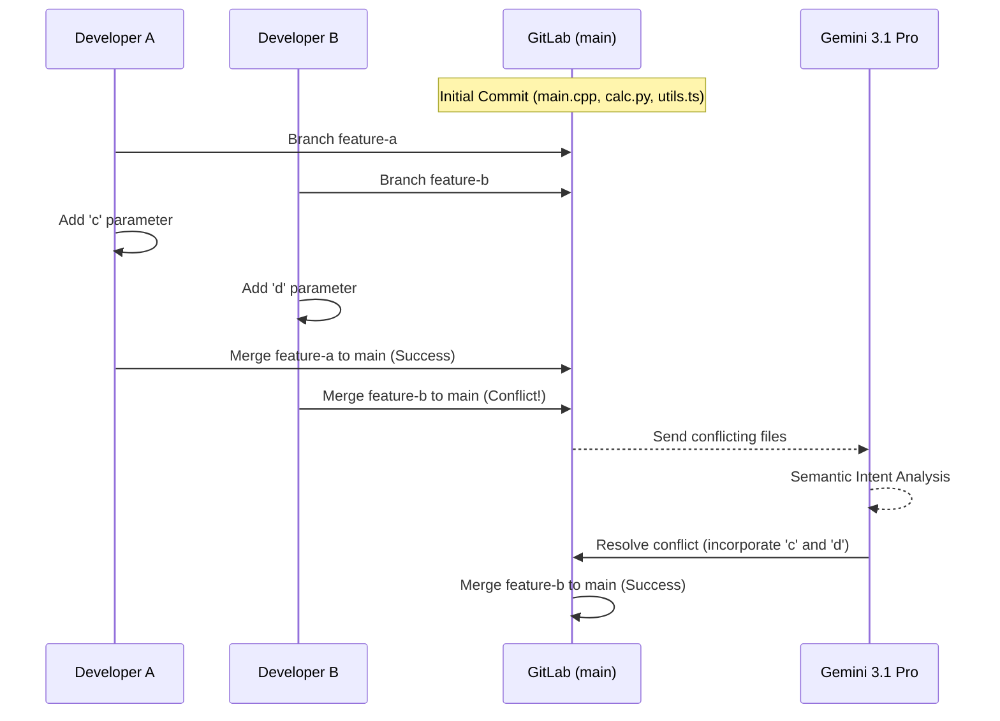

# Git-AI Benchmark User Manual

## Overview
The `git-ai benchmark` command is a built-in self-test suite designed to prove the efficacy and accuracy of the Semantic Orchestration Layer. Instead of running a local simulation, this command interacts directly with the **real GitLab API** to create a live repository, simulate developer activity, generate merge conflicts, and resolve them using Gemini 3.1 Pro.

Our final hackathon repository is: [https://gitlab.com/gitlab-ai-hackathon/participants/35450504.git](https://gitlab.com/gitlab-ai-hackathon/participants/35450504.git).

## How It Works
When you run `git-ai benchmark` in the terminal, the system executes the following steps in real-time:

1. **Project Creation**: A new private repository is created on GitLab (e.g., `git-ai-benchmark-1710000000000`).
2. **Initial Commit**: The `main` branch is initialized with three files:
   - `main.cpp` (C++)
   - `calc.py` (Python)
   - `utils.ts` (TypeScript)
3. **Branching**: Two new branches are created from `main`: `feature-a` and `feature-b`.
4. **Concurrent Development**:
   - **Developer A** commits changes to `feature-a`, adding a `c` parameter to the functions in all three files.
   - **Developer B** commits changes to `feature-b`, adding a `d` parameter to the same functions in all three files.
5. **First Merge**: A Merge Request is created for `feature-a` and merged into `main` successfully.
6. **Conflict Generation**: A Merge Request is created for `feature-b`. Because `main` now contains Developer A's changes, GitLab detects a merge conflict across all three files.
7. **Semantic Resolution**: The system detects the conflict and sends the conflicting states of `main.cpp`, `calc.py`, and `utils.ts` to Gemini 3.1 Pro.
8. **AI Commit**: Gemini understands the semantic intent (adding parameters) and resolves the conflict by incorporating both `c` and `d` parameters. The resolved files are committed back to `feature-b`.
9. **Final Merge**: With the conflicts resolved, `feature-b` is successfully merged into `main`.
10. **Verification**: The terminal provides a direct link to the live GitLab repository so you can inspect the commits, branches, and the AI's conflict resolution yourself.

## Benchmark Specifications

* **Primary (Master) Branch**: `main`
* **Total Branches Used**: 3 (`main`, `feature-a`, `feature-b`)
* **Simulated Users**: 2 (Developer A and Developer B)
* **Supported Languages**: The Semantic Orchestration Layer supports **any programming or human language** that Gemini 3.1 Pro can understand. 
* **Demo Languages**: For the purpose of this specific benchmark demo, we showcase multi-language resolution across:
  * **C/C++** (`main.cpp`)
  * **Python** (`calc.py`)
  * **TypeScript** (`utils.ts`)

## Prerequisites
To run the benchmark, you must provide a real GitLab Personal Access Token:
1. Go to your GitLab account settings -> Access Tokens.
2. Create a new token with the `api` scope.
3. In the AI Studio **Settings** menu, add a new secret named `GITLAB_TOKEN` and paste your token.

## Running the Benchmark
1. Open the **Terminal** tab in the application.
2. Type `git-ai benchmark` and press Enter.
3. Watch the live Server-Sent Events (SSE) stream as the system orchestrates the real GitLab repository.
4. Click the provided link at the end to view the repository on GitLab.
