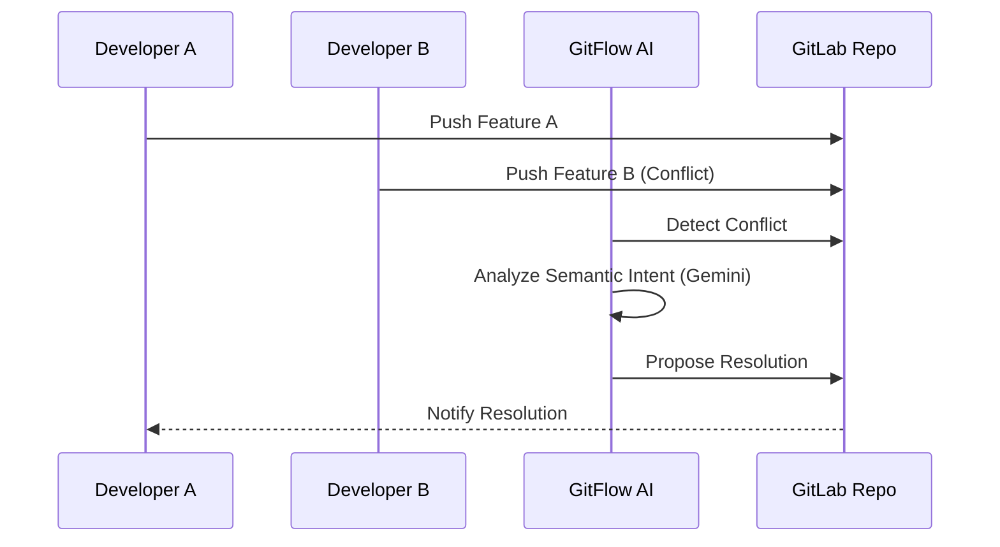

# GitFlow AI Benchmark Guide

The `git-ai benchmark` command is a built-in self-test suite that demonstrates the capabilities of GitFlow AI in resolving complex merge conflicts and managing team workflows.

## Benchmark Architecture



## How to Run the Benchmark

You can run the benchmark directly from the **CLI Terminal** tab in the application.

### Available Phases

The benchmark is divided into several phases to simulate a real-world development lifecycle:

1. **`benchmark A`**
   - Simulates Developer A's workflow.
   - Creates a new feature branch and pushes initial commits.

2. **`benchmark B`**
   - Simulates Developer B's workflow.
   - Creates a conflicting feature branch and pushes commits that overlap with Developer A's work.

3. **`benchmark team`**
   - Simulates team activity.
   - Sets up a GitLab project and prepares the repository for collaboration.

4. **`benchmark conflict`**
   - The core of the benchmark.
   - Simulates a complex merge conflict scenario between Developer A and Developer B.
   - Demonstrates how GitFlow AI automatically analyzes the conflict, understands the intent of both developers, and proposes a semantic resolution.

## What the Benchmark Proves

- **Verifiable Trust:** You don't have to take our word for it. The benchmark runs real Git commands and interacts with the actual AI models.
- **Semantic Understanding:** It proves that the AI doesn't just look at lines of code, but understands the *meaning* and *intent* behind the changes to resolve conflicts intelligently.
- **Automated Workflow:** It showcases how the AI integrates seamlessly into the Git workflow, catching issues before they break the main branch.

## Running Locally

If you have installed the `git-ai` CLI tool locally, you can also run the benchmark self-test from your own terminal:

```bash
git-ai benchmark
```

This will run a self-test to measure API latency and verify connections to both the Git provider and the AI models.
